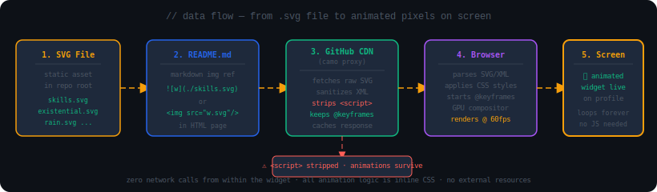

<p align="center">
  
</p>

**animated SVG widgets that make your GitHub profile go brrr — no npm, no build step, no existential dread (well, there's one widget for that)**

[Features](#-features) • [Installation](#-installation) • [Usage](#-usage) • [Architecture](#-architecture) • [Roadmap](#-roadmap) • [License](#-license)

---

*You know that feeling when your GitHub profile is just a wall of text and a green squares grid? widget-templates is what you put there instead. Twenty hand-crafted, fully animated SVG widgets — each a single file, no runtime, no dependencies — that you paste into your README in about 30 seconds and immediately look like you spent a weekend on it.*

widget-templates is a collection of 20 standalone `.svg` files for GitHub profile READMEs and personal websites. Every widget is animated with inline CSS `@keyframes` — the one animation technique GitHub's SVG sanitizer preserves while stripping everything else. Each file is self-contained, under 10 KB, and embeds with a single line of markdown. There's no package to install, no server to run, and no configuration file waiting to bite you.

---

## Badges

<p align="center">


</p>

---

## 🧠 System Overview

This isn't a framework or a SaaS. It's a folder of SVGs that are genuinely good at being SVGs.

Each widget is a single `.svg` file containing structure (SVG elements), styles (inline CSS with `@keyframes`), and definitions (gradients, filters, reusable shapes) — all in one file, no external resources. Drop it in your repo, reference it in markdown, done. See the [Architecture docs](docs/wiki/Architecture.md) for a deeper look at how GitHub processes these files.

```
widget-templates/
├── existential.svg        ← each widget is one self-contained file
├── github-stats.svg
├── ...                    ← (20 total)
├── assets/                ← README assets (diagrams, hero)
├── docs/wiki/             ← detailed documentation
├── example-profile-README.md
└── README.md
```

<p align="center">
  
</p>

The deployment model is as static as it gets: user picks a file, drops it in their repo, references it in markdown, and GitHub's CDN serves the raw SVG bytes. No build pipeline, no server, no caching layer you control. GitHub's `camo` proxy sanitizes the SVG on the way out — stripping `<script>` tags and event handlers while preserving CSS animations — and that's the whole stack.

---

## ✨ Features

### 🖤 Terminal Widgets
| Feature | What it actually does |
|---|---|
| 🌧️ `existential.svg` | Renders columns of characters falling top-to-bottom in staggered `translateY` animations. Each column has a different `animation-delay` so they don't all start at once. |
| 📊 `github-stats.svg` | Displays a fake-but-convincing terminal window with commit streaks, star counts, and contribution stats. The numbers are yours to edit. |
| 😄 `joke.svg` | Shows a two-part programming joke with setup and punchline separated by a timed `opacity` animation. |
| 🌧️ `rain.svg` | ASCII rainfall using `translateY` keyframes on monospace characters at varying speeds. Genuinely calming. |
| 📈 `skills.svg` | Progress bars that animate from 0% to their target width via `scaleX` on load. Labels and values are plain text — edit freely. |
| 🟢 `status.svg` | Pulsing status indicator with customizable activity text. Good for "currently building X" or "ask me about Y". |

### 📁 Code & File Widgets
| Feature | What it actually does |
|---|---|
| 💻 `code-editor.svg` | VS Code window frame with syntax-highlighted Python (keyword, string, comment colors) and a `steps()`-timed blinking cursor. |
| 📂 `file-explorer.svg` | macOS Finder-style file list with `translateX` slide-in animations per row. Light theme. |

### 🌿 Git Widgets
| Feature | What it actually does |
|---|---|
| 🕰️ `commit-history.svg` | GitHub-style commit timeline with colored branch lines and commit dot markers. |
| 🟩 `contribution-graph.svg` | The contribution grid — colored squares in GitHub's green palette, arranged in a week × month layout. |

### 🛠️ Utility Widgets
| Feature | What it actually does |
|---|---|
| ☀️ `weather.svg` | Animated sun with rotating rays, cloud shapes that drift, and weather data text fields. Light theme. |
| 🎵 `music-player.svg` | Spotify-ish player UI with `scaleY` equalizer bars that animate at different speeds to simulate audio playback. |
| 📅 `calendar.svg` | Monthly grid with today's date highlighted. Static month/year — edit the text to update it. |
| 💻 `system-monitor.svg` | CPU, RAM, disk, and network gauges with animated fill bars. Values are static — set them to whatever looks accurate. |
| 🌍 `time-zones.svg` | World clock showing multiple cities and their UTC offsets. Times are static text — update when you remember. |
| 🌐 `network-activity.svg` | Network topology diagram with dots animating along connecting lines to simulate packet travel. |

### 📊 Social & Progress Widgets
| Feature | What it actually does |
|---|---|
| 👥 `social-stats.svg` | Follower counts and growth percentages for social platforms. Fully static — your numbers, your call. |
| ✅ `progress-tracker.svg` | Project milestone bars with animated checkmarks that appear as bars reach 100%. |
| ✨ `inspiration-quote.svg` | Quote text with a gradient shimmer animation and decorative sparkle elements. |

---

## 🗺️ Capability Visualization

<p align="center">
  
</p>

---

## 🏗️ Architecture

> It's not that complicated. That's the point.

<p align="center">
  
</p>

Each SVG widget is structured in three layers: **definitions** (`<defs>` — gradients, filters, markers), **styles** (`<style>` — `@keyframes` and class selectors), and **elements** (the actual `<rect>`, `<text>`, `<line>`, and `<path>` nodes that form the visual). There are no threads, no processes, and no state — the CSS animation engine in the browser is the only runtime that touches these files.

The critical design constraint is GitHub's SVG sanitizer. GitHub strips `<script>` tags and inline event handlers (`onclick`, `onload`, etc.) from SVGs before serving them. CSS `@keyframes` animations survive this sanitization intact, which is why every widget uses them exclusively. This isn't a workaround — it's the intended path. The constraint also eliminates an entire category of security concern: no widget can phone home, execute arbitrary code, or track the viewer.

---

## 🌊 Data Flow

<p align="center">
  
</p>

Primary data path:

```
SVG file on disk
  → referenced in README.md as  
  → GitHub fetches raw SVG bytes
  → camo proxy sanitizes (strips scripts, preserves @keyframes)
  → browser receives clean SVG
  → CSS animation engine starts @keyframes
  → frames rendered at 60fps forever
```

No network calls originate from within the widget itself. No external fonts, no remote images, no API calls. The only bytes that travel are the SVG file itself.

---

## 📦 Installation

No build tool, no package manager, no runtime. The files in this repo are the product.

### Option A: GitHub Profile README

**1.** Copy or download the `.svg` file(s) you want — clone the repo or download individual files.

**2.** Upload them to your GitHub profile repository — the special repo named `<your-username>/<your-username>`. That's the one whose README shows up on your profile page.

**3.** Reference the file in your `README.md`:

```markdown

```

Use HTML for layout control (centering, side-by-side):

```html
<p align="center">
  
</p>
```

> **Pro tip:** If your widget looks right in a browser but doesn't animate on GitHub, wait a few minutes. GitHub's `camo` CDN caches SVGs aggressively — force a cache bust by appending `?v=2` to the filename in your markdown reference.

### Option B: Personal Website / HTML

```html
<!-- As an image element -->


<!-- Inlined directly in HTML — gives you CSS/JS access to the SVG's internals -->
<!-- Paste the SVG file's contents directly into your HTML document -->
```

Inlining gives you the ability to override colors with external CSS, which you can't do with ``. Useful if you're theming a portfolio site.

### Option C: Clone the repo

```bash
git clone https://github.com/Kaelith69/widget-templates.git
cd widget-templates
# Pick your widgets, copy them to your project, customize
```

---

## 🚀 Usage

**1.** Pick a widget from the list above.

**2.** Copy the `.svg` file to wherever you're using it.

**3.** Reference it in markdown:

```markdown

```

**4.** Customize the text — open the file in any text editor, find `<text>` elements, change the content:

```xml
<!-- find this -->
<text x="16" y="48">skill issue</text>

<!-- change it to whatever -->
<text x="16" y="48">i know exactly what i'm doing</text>
```

**5.** Adjust colors by finding `fill="#..."` values and swapping them:

```xml
<text fill="#10B981">green text</text>
<rect fill="#1e293b"/>
```

**6.** Tweak animations by editing the `<style>` block:

```css
.bar {
  animation-duration: 2s;    /* slower */
  animation-delay: 0.5s;     /* starts later */
}
```

**7.** Resize by adjusting `viewBox`, `width`, and `height` on the root `<svg>` element:

```xml
<svg viewBox="0 0 400 200" width="400" height="200">
```

> **Pro tip:** Don't change just `width`/`height` without matching the `viewBox`. SVG scales the content to fit the viewBox — if you only change the outer dimensions, you'll stretch or squash the widget.

---

## 📂 Project Structure

```
widget-templates/
│
├── 🖤 existential.svg          # Matrix-style falling character columns
├── 🖤 github-stats.svg         # Terminal window: mock GitHub stats
├── 🖤 joke.svg                 # Terminal: two-part programming joke
├── 🖤 rain.svg                 # ASCII rain, multiple falling streams
├── 🖤 skills.svg               # Animated skill progress bars
├── 🖤 status.svg               # Pulsing status indicator
│
├── 💻 code-editor.svg          # VS Code–style Python editor + cursor
├── 📂 file-explorer.svg        # macOS Finder panel, slide animations
│
├── 🌿 commit-history.svg       # Git commit timeline with branch lines
├── 🌿 contribution-graph.svg   # GitHub contribution grid
│
├── ☀️  weather.svg              # Animated sun, clouds, weather data
├── 🎵 music-player.svg         # Equalizer bars, now-playing display
├── 📅 calendar.svg             # Monthly calendar, today highlighted
├── 💻 system-monitor.svg       # CPU/RAM/disk/network gauges
├── 🌍 time-zones.svg           # World clock, multiple cities
├── 🌐 network-activity.svg     # Network topology, animated packets
│
├── 👥 social-stats.svg         # Follower counts and growth percentages
├── ✅ progress-tracker.svg     # Project milestones with checkmarks
├── ✨ inspiration-quote.svg    # Quote with gradient shimmer
│
├── assets/                     # README diagrams and hero image
│   ├── hero-banner.svg         # Project hero banner (820px)
│   ├── architecture.svg        # Architecture diagram
│   ├── data-flow.svg           # Data flow pipeline
│   ├── capabilities.svg        # Feature/capability map
│   └── stats.svg               # Performance stats dashboard
│
├── docs/wiki/                  # Detailed documentation
│   ├── Home.md
│   ├── Architecture.md         # Deep dive on SVG structure + animation
│   ├── Installation.md
│   ├── Usage.md
│   ├── Privacy.md
│   ├── Roadmap.md
│   └── Troubleshooting.md
│
├── example-profile-README.md   # Full example profile layout using the widgets
├── CONTRIBUTING.md
├── SECURITY.md
├── CHANGELOG.md
└── README.md                   # You are here
```

---

## 📊 Performance Stats

<p align="center">
  
</p>

---

## 🔒 Privacy

These widgets are static files. They phone home to exactly **nobody**.

- No analytics, no tracking pixels, no beacon requests
- No external CDN dependencies inside any widget file
- No user data collected, stored, processed, or sold
- The only network request involved is your web server (or GitHub) serving the `.svg` file itself — a normal HTTP GET for a static asset

The widgets have no mechanism for tracking viewers because they have no mechanism for anything at runtime except playing CSS animations. That's a feature, not a limitation.

See [docs/wiki/Privacy.md](docs/wiki/Privacy.md) for a full breakdown.

---

## 🔭 Roadmap

**Theme variants**
- [ ] Dark/light theme variants for all widgets (currently mixed)
- [ ] Additional terminal themes: gruvbox, solarized, catppuccin

**New widget types**
- [ ] Interactive SVG widgets with JavaScript (opt-in, clearly labeled as JS-required)
- [ ] Additional language support in `code-editor.svg`: JavaScript, Rust, Go
- [ ] Typing animation widget (text that types itself out)

**Developer experience**
- [ ] Widget picker / live preview tool (single HTML file in repo, no server)
- [ ] GitHub Actions CI to auto-validate SVG syntax on PRs
- [ ] Automated screenshot tests to catch broken animations

**Accessibility**
- [ ] `prefers-reduced-motion` support across all animated widgets
- [ ] ARIA labels and `role` attributes for screen readers

---

## 📦 Packaging

There's nothing to build. The `.svg` files in the repo root are the distributable. If you want to bundle them:

```bash
# Grab just the SVG files
zip widgets.zip *.svg

# Or copy to your own project
cp existential.svg rain.svg skills.svg ~/my-project/
```

For automated workflows, the files are also accessible directly via GitHub's raw content URL:
```
https://raw.githubusercontent.com/Kaelith69/widget-templates/main/skills.svg
```

---

## 🤝 Contributing

Pull requests welcome. See [CONTRIBUTING.md](CONTRIBUTING.md) for the full guide — branching model, commit style, SVG guidelines, and the PR checklist.

Short version: keep widgets self-contained, no external URLs, CSS animations only, under 10 KB.

---

## 🔐 Security

To report a vulnerability, use the [GitHub Security Advisory](https://github.com/Kaelith69/widget-templates/security/advisories/new) — it's private and goes directly to the maintainer. See [SECURITY.md](SECURITY.md) for the full policy.

---

## 📄 License

MIT — see [LICENSE](LICENSE) for the full text.

Built by [Kaelith69](https://github.com/Kaelith69).
