# 👋 Hi, I'm [Your Name]!

I'm a passionate developer who loves creating beautiful and functional applications. Welcome to my GitHub profile!

## 🚀 About Me

- 🔭 I’m currently working on exciting web development projects
- 🌱 I’m learning new technologies and frameworks
- 💬 Ask me about JavaScript, Python, or web development
- 📫 How to reach me: [your-email@example.com]
- ⚡ Fun fact: I love coding while listening to music!

## 📊 GitHub Stats & Activity

  
  

## 💻 Coding Environment

  

## 📁 My Projects & Files

  

## 🔄 Recent Activity

  

## 🎵 Currently Listening & Weather

  
  

## 📅 Schedule & Time Zones

  
  

## 🔧 System & Network

  
  

## 📈 Progress & Social

  
  

## 🎯 Skills & Status

  

## 🤔 Current Status

  

## 💭 Inspiration

  

## 😄 Fun Stuff

  
  

## 🤯 Deep Thoughts

  

## 🛠️ Technologies & Tools

## 📚 Latest Blog Posts

<!-- BLOG-POST-LIST:START -->
- [How to Create Animated SVG Widgets](https://example.com/blog/svg-widgets)
- [Building Interactive Web Components](https://example.com/blog/web-components)
- [Mastering CSS Animations](https://example.com/blog/css-animations)
<!-- BLOG-POST-LIST:END -->

## 🤝 Let's Connect!

---

⭐️ From [your-username](https://github.com/your-username) | 📧 [your-email@example.com]